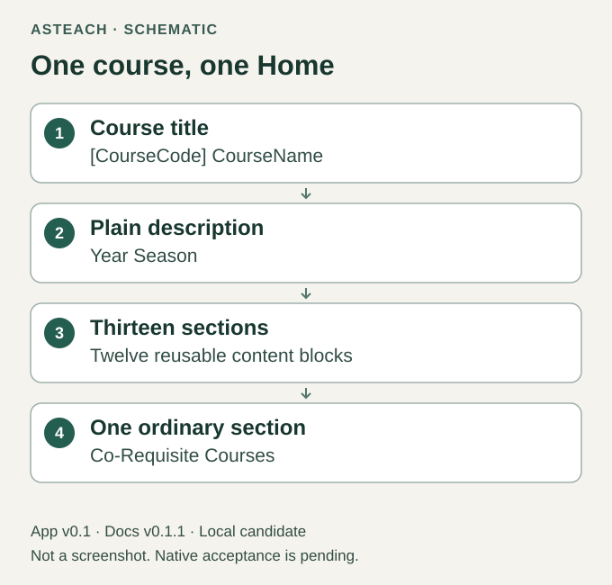

# asTeach User Guide

Docs v0.1.1 for App v0.1 — One-Page GitBook Course Template.

Created by SONG Chaoyang ([songcy@ieee.org](mailto:songcy@ieee.org)) @ Design and Learning Research Group ([https://AncoraSIR.com](https://AncoraSIR.com)).

Create one course Home, then maintain its course description, goals, schedule
and other sections in GitBook. After one-time setup, the intended everyday
workflow is to edit your own reusable content directly. No agent, JSON form
or class generator is needed for ordinary course-content editing.

This release candidate is supplied for private evaluation. Its complete fresh
GitBook import and editing walkthrough remain unverified. Read
[Version and Scope](version-and-scope.md) before hosted evaluation. The private
handoff identifies the exact integrated App source commit and archive; this guide does not
announce a public release.

Figure 1. Course structure schematic for App v0.1; not a GitBook screenshot or
evidence that the candidate has imported successfully.

Begin with [Before You Start](getting-started.md), then follow
[Set Up Your Course](setup-gitbook.md). Once your own resources have passed the
setup checks, use [Edit Your Course](one-page-course.md).

The starter contains replaceable formatting guidance. You supply the
course facts, dates, people, learning outcomes, references and policies.
Its mapping contains only course material; private planning belongs elsewhere.

Guide text and original diagrams: [CC BY 4.0](https://creativecommons.org/licenses/by/4.0/).
Original App tooling, template and workbook use [MIT](../../LICENSE); the adapted
`scripts/check_docs.py` retains CC BY 4.0 alongside this guide. This guide ships
inside the same App archive. Begin local setup with [START-HERE](../../START-HERE.md).
The App's GitBook template mapping remains `templates/one-page/`; packaging the
guide here does not change guide hosting or map these pages into a course Home.
