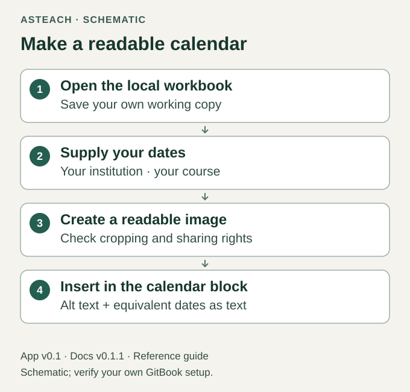

# Calendar and Files

Docs v0.1.1 · for App v0.1 · release candidate

The generic workbook is in your course workspace at
`course/.gitbook/assets/calendar-2000-2050.xlsx`. Open it locally from the
extracted files. It has year sheets for 2000–2050, blank Week # cells, continuous
week rows and neutral month bands. It supplies no university holidays,
teaching weeks or course dates.

## Prepare the course calendar

1. Save a working copy outside the mapped course directory.
2. Choose the year sheet and enter your own week numbers and verified
   institutional/course dates.
3. Make readable calendar images from the relevant area, using only material
   you are authorized to share. Check that no other windows or personal details
   appear in a capture.
4. In the University Calendar reusable block, remove the setup workbook link
   and guidance from the finished course text. Insert your calendar image(s)
   into that existing block.
5. Add alt text identifying the calendar's term and purpose, and a nearby text
   equivalent for dates and events that readers need. Keep important dates
   available as text; alt text alone is not a full calendar transcription.
6. Save, reopen and inspect the image at ordinary desktop and narrow-page width.

Figure 5. Calendar preparation and accessibility workflow; schematic, not an
image of an institutional calendar or GitBook controls.

The included workbook link is a local source-relative link. A successful local
open does not prove a hosted download. Native workbook downloads and the new
image editing round trip remain pending for this candidate. Do not rely on the
starter workbook link as a student delivery method.

## Choose how to deliver other files

| Method | What to verify |
| --- | --- |
| GitBook native file block | GitBook stores an uploaded copy. Test Open and Download from the intended reader's view. |
| Ordinary external file link | The reader visits that host. Test authorization, filename and completed download. |
| Separate materials repository | Each offering can have its own folder and links; access applies to that repository. |

GitBook documents [uploading and inserting files](https://gitbook.com/docs/create-content/blocks/insert-files).
Uploading a file and adding a link to an existing file are different actions.

A private GitHub link requires an authorized account. Making course materials
accessible does not require making course source public: separate materials
storage is an option you choose. Review the rights and metadata of each file,
then test the actual intended audience. This candidate does not create storage,
upload materials or change their access.
