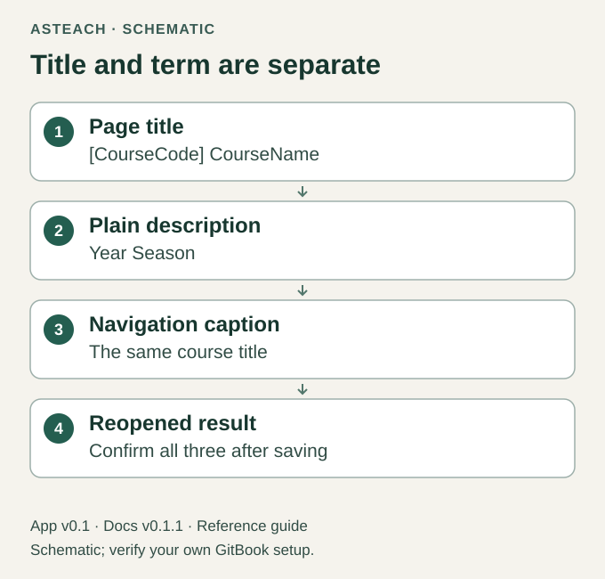

# Edit Your Course

Docs v0.1.1 · for App v0.1

The intended normal workflow is to edit Home's reusable bodies in GitBook.
No JSON, agent, local generator or second preparation form is needed.
First complete the [setup ownership checks](setup-gitbook.md).

## Edit an existing reusable body

1. Open your course Home and select Edit to start the Space's change request.
   If a draft already contains your work, open that draft instead of starting
   a competing edit.
2. Click inside the existing Course Description text. Confirm that its reusable
   resource belongs to your course Space.
3. Replace the visible guidance with a short piece of your own course text.
   Keep the surrounding Course Description heading and the reusable block.
   Do not detach it to make it editable.
4. Inspect Changes and Overview. Confirm the intended reusable-body change is
   included and unrelated content is preserved. Follow the Space's review
   requirements, then merge.
5. Reopen Home outside the change request after loading completes. Confirm your
   text is present. With Git Sync enabled, inspect the resulting repository
   commit and its include-file change before doing later local work.

A reusable resource has one parent that controls editing, and merged changes
propagate to its uses. [GitBook's reusable-content documentation](https://gitbook.com/docs/create-content/reusable-content)
describes this behavior. The release records the tested template's acceptance;
repeat the saved-result check in your own Space.

## Set the title and term

Replace `[CourseCode] CourseName` with your course code and title. Set the
description to your year and season as plain text, in `Year Season` order.
Confirm the page title, navigation caption and reopened result agree; changing one visible field is
not proof that all three are correct.

Figure 4. Intended title and description relationship; not a screenshot.

Verify these container edits separately from reusable-body edits. GitBook's
[configuration guidance](https://gitbook.com/docs/docs-as-code/git-sync/content-configuration)
warns that editing `README.md` through GitBook with Git Sync can create conflicts
or duplicate pages. The template retains its agreed Home filename. If a
duplicate or conflict appears, preserve the draft and saved source, stop that
edit, and use [Troubleshooting](troubleshooting.md); do not rename the container
or flatten resources as a workaround.

## Replace the section guidance

Learning Outcomes has its own reusable block immediately after Teaching Goals.
After verifying its ownership and editability, replace the guidance and
`LearningOutcome` placeholder with your measurable learning outcomes as bullets.
Use observable action verbs to state what learners should be able to do.

Co-Requisite Courses follows Assumed Knowledge and has its own reusable block.
After verifying its ownership and editability, replace its guidance and `CourseCode — CourseTitle`
placeholder with the codes and titles of courses studied concurrently. Write
`None` only if you have confirmed that no co-requisites apply. Verify its saved
resource body and reopened Home as with every other reusable section.

The guidance supplies a format, not course facts. Leave a section blank if you
have no confirmed information, and remove unreplaced guidance before sharing.
Missing information does not mean `None`, and no policy may be inferred.

## Prepare a term snapshot

Keep one private Teacher Home with all thirteen reusable sections. Fresh courses
use Product Docs presentation at default width; an existing course's saved layout
requires a separately reviewed change. Prepare each `Year Season` as a separate
ordinary-content snapshot under its term Group. Detach only the copied instances:
the Teacher Home and its source resources remain the editable inputs. Check that
the term contains no reusable includes or live resource bindings.

Preserve the accepted title, plain description, wording, lists, schedule and
links. Remove a whole term section only when the instructor has confirmed that
its complete answer is exactly `None`. Do not treat blank, unknown, ambiguous or
partly answered content as `None`. Keep the corresponding Teacher heading,
resource and answer intact. Add a late-submission policy only from supplied
instructor wording; a request to finish the course is not a policy.

Historical term pages use Docs presentation at default width. Before replacing
an existing term, reconcile its saved source, newer edits, comments and drafts.
This guide describes manual preparation; the initializer never updates a course.

## Prepare an independent Student copy

Use the reviewed term snapshot as the source for the matching Student page.
Use ordinary content with Docs presentation at default width, with no Teacher
reusable or Teacher asset references. Verify ownership of each retained or
inserted image in the Student Space itself; copying visible content does not
prove independent ownership. Follow the [calendar and file checks](calendar-and-files.md).
Do not remove unrelated Student Library entries just because their old page
instances were detached.

Compare the whole saved Student body and every link with the accepted term.
Check its native editor and published reader view separately, including the
full calendar and old page routes. Use [Save, Check and Share](review-and-sharing.md)
before merging; an existing published Site may update immediately.

Use [Course Home Reference](course-home-reference.md) for the full section order,
[Schedule and Deadlines](schedule-and-deadlines.md) for manual dates, and
[Save, Check and Share](review-and-sharing.md) before sharing.
