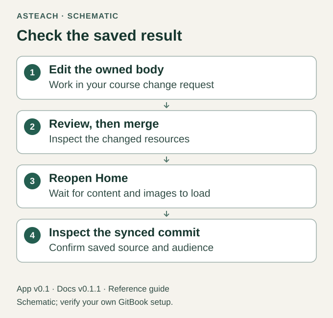

# Save, Check and Share

Docs v0.1.1 · for App v0.1 · release candidate

Review the saved course from the view its intended readers will use.
A local file or editor draft does not establish the saved result.

## Complete the editing cycle

1. Reconcile the current saved export, repository, source Library edits, open
   drafts and relevant comments before editing. In Changes, inspect the course
   edits, including reusable-resource changes.
   Give delayed resource changes time to appear before deciding the review is
   complete.
2. In Overview, follow the course Space's review requirements and merge when
   the changes are ready. GitBook documents [change-request review and merging](https://gitbook.com/docs/collaborate/change-requests).
3. Reopen Home outside the draft, wait for resources and images to load, and
   compare the result with your intended change.
4. With Git Sync enabled, confirm its completed state and inspect the new
   repository commit. Compare the full saved export and file inventory, including
   assets, with the accepted source and verify unrelated files are preserved.
   Inspect source Library changes too; a Git diff alone cannot show unsaved native
   changes. An unmerged draft is not a repository backup.

Figure 6. Saved-result check; schematic, not proof of a successful native save.

## Review the whole course

Confirm the title and navigation agree and the term is plain text. Check all
thirteen Teacher headings and the accepted section set of each ordinary term or
Student copy. Confirm any omitted section had the complete confirmed answer
`None` and its Teacher input is preserved. Check your supplied content, actual facts,
percentages, people, policies, dates and references. Remove unused placeholders
and formatting guidance.

Check that reusable resources belong to this course, images have useful alt
text, dates are readable as text, and external links and completed downloads
work for the intended reader. Navigate through Teaching Schedule at the top
level; module deep links are not a v0.1 feature.

Term snapshots must have no reusable includes. Student content must also have
no Teacher resource or asset references. Verify full-size calendars, the saved
native view and published view independently. Check prior page URLs as well as
new navigation links: native routes can drift even if their Git filenames do
not change. If a route or image fails, preserve the saved state and record the
specific failing view before a separately reviewed correction.

Confirm the visible page, navigation and mapped files contain only course
material. Hiding a navigation item does not make its contents private. Private
preparation belongs outside the course repository and mapping.

## Choose an audience

Repository visibility, Space access and a published Site are separate settings.
Keep the first evaluation restricted. When you choose to share, inspect the
actual access settings and test with an account representing that audience.

Merging updates the Space's saved content. If it is already connected to a
published Site, those changes may become visible immediately. Therefore review
the audience before merging as well as before initial sharing. This workflow
does not promise a separate staging or student-publishing step.

App v0.1 does not automate transfer into a Student copy. Follow the manual
[term and Student workflow](one-page-course.md) with
reviewed ordinary content and independently owned assets.
For candidate acceptance limits, see [Version and Scope](version-and-scope.md).
