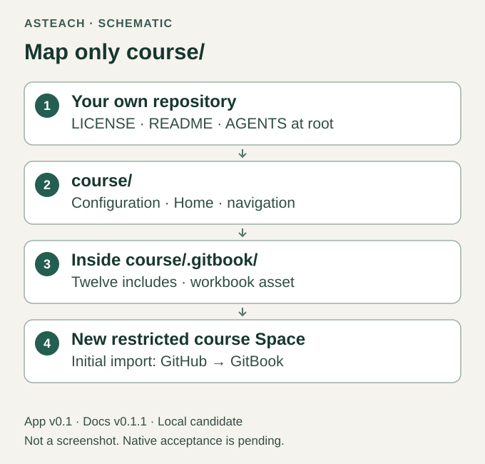
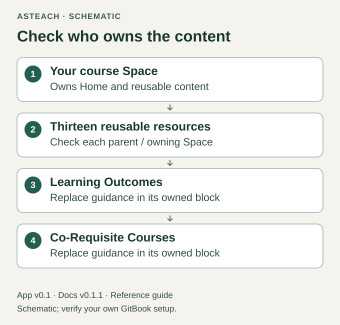

# Set Up Your Course

Docs v0.1.1 · for App v0.1 · release candidate

This is the planned fresh-course walkthrough. The exact candidate still needs
a hosted run that proves its import, ownership and editing behavior. Use a new
empty restricted destination for that evaluation.

## 1. Prepare a fresh course workspace

Open the included App's [START-HERE](../../START-HERE.md); it is the authoritative source for
the optional initializer commands and manual-copy procedure. It offers
verification, a fresh-destination plan, application of that exact plan and a
read-only baseline check. Review the destination before applying. It creates
local files only; it does not create a Git repository, connect accounts or sync.

For manual setup, reproduce the same layout from the exact App candidate:
copy its root `LICENSE` and its `course-template/README.md` and
`course-template/AGENTS.md` to your new workspace root. Copy the contents
of `templates/one-page/`, including hidden files, into `course/`.
Do not copy the whole App into the course folder. Confirm all sixteen course
files against the App inventory. The result is:

```text
my-course/
  LICENSE
  README.md
  AGENTS.md
  course/
    .gitbook.yaml
    README.md
    SUMMARY.md
    .gitbook/
      includes/    (12 reusable Markdown files)
      assets/      (calendar-2000-2050.xlsx)
```

The names above describe a neutral layout, not a real course. The root license
retains the App notice without becoming a course page. Course content stays
inside `course/`; the initializer's destination is the whole `my-course/`
workspace, not its inner course folder. Do not use the initializer over an
existing course or rerun it to repair authored edits.

## 2. Put that workspace in your own repository

Use your usual Git client, or GitHub Desktop. In Desktop, add the new workspace
as a local repository; if it has no Git repository, use Desktop's prompt to
create one at that folder. Review the path and files before continuing. Do not
generate a replacement README or license over the copied files.

In Changes, select the nineteen intended files, enter a short commit summary,
and commit to the current branch. Select Publish repository, choose your own
account or organization, and keep the repository private. Open View on GitHub
and inspect `course/`, including `.gitbook/` and `.gitbook.yaml`. Record
the actual branch and commit shown there. GitHub documents the
[repository and commit workflow](https://docs.github.com/en/desktop/overview/creating-your-first-repository-using-github-desktop).
An existing remote or a previously authored course needs reconciliation first.

## 3. Connect only the course directory

Create a new empty restricted course Space, separate from your other content.
Inspect its access before entering course material. For standalone Space Git
Sync, use Set up beside Git Sync in the Space header, then GitHub Sync.
Authenticate the GitHub account that owns the new course repository; grant the
integration access to the chosen repository.

The intended mapping is:

| Setting | Value for this layout |
| --- | --- |
| Repository | Your own new course repository |
| Branch | The branch containing the inspected nineteen-file workspace |
| Space-level Project directory | `course/` |
| Configuration found there | `course/.gitbook.yaml` with `root: ./` |
| First page / navigation | `README.md` / `SUMMARY.md`, within `course/` |
| Initial direction | GitHub → GitBook, importing the existing course files |

GitBook also has site-wide Git Sync with a separate Project directory and
Content mapping. If that form appears, do not substitute these space-level
values into it or add other Spaces: return to standalone Space Git Sync.
This walkthrough does not configure a Site. The current
[GitHub Sync guide](https://gitbook.com/docs/docs-as-code/git-sync/enabling-github-sync)
documents the standalone entry and initial direction; the
[configuration guide](https://gitbook.com/docs/docs-as-code/git-sync/content-configuration)
describes the space content root.



Figure 2. Exact intended directory boundary; schematic, not a native setup form.

Before starting Sync, recheck repository, branch, directory and destination.
The initial direction can replace destination content, which is why this route
uses an empty Space. Afterward Git Sync works both ways: merging GitBook change
requests writes commits to the connected branch; repository commits sync back.

## 4. Inspect the imported result

Wait for synchronization to finish, then open Home and allow reusable content
to load. Expect one Home in navigation, the full placeholder course title,
plain `Year Season` description, thirteen section headings and twelve
reusable resources. Internal include files, root instructions and private
preparation must not appear as pages.

Open the reusable-content panel or Library and inspect the owning Space/section
of all twelve resources. They must belong to this destination, including the
Learning Outcomes block with replaceable guidance. Merely seeing text or a
resource count does not prove ownership. A foreign, read-only, missing or persistently loading block
means the import has not passed.



Figure 3. Required ownership relationship; a schematic of the acceptance check.

GitBook explains [parent ownership and reusable editing](https://gitbook.com/docs/create-content/reusable-content).
Perform the small edit and reopened-result check in
[Edit Your Course](one-page-course.md), then inspect the saved export. Keep a
record of the actual candidate digest, course source commit and observations.

ZIP import and Space duplication are not supported alternative setup routes
for this candidate. Continue only when the intended resource ownership is clear.
